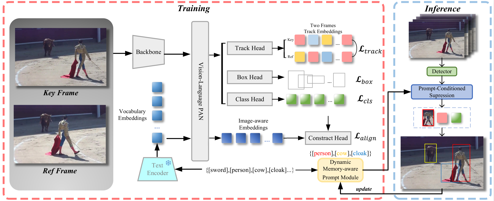
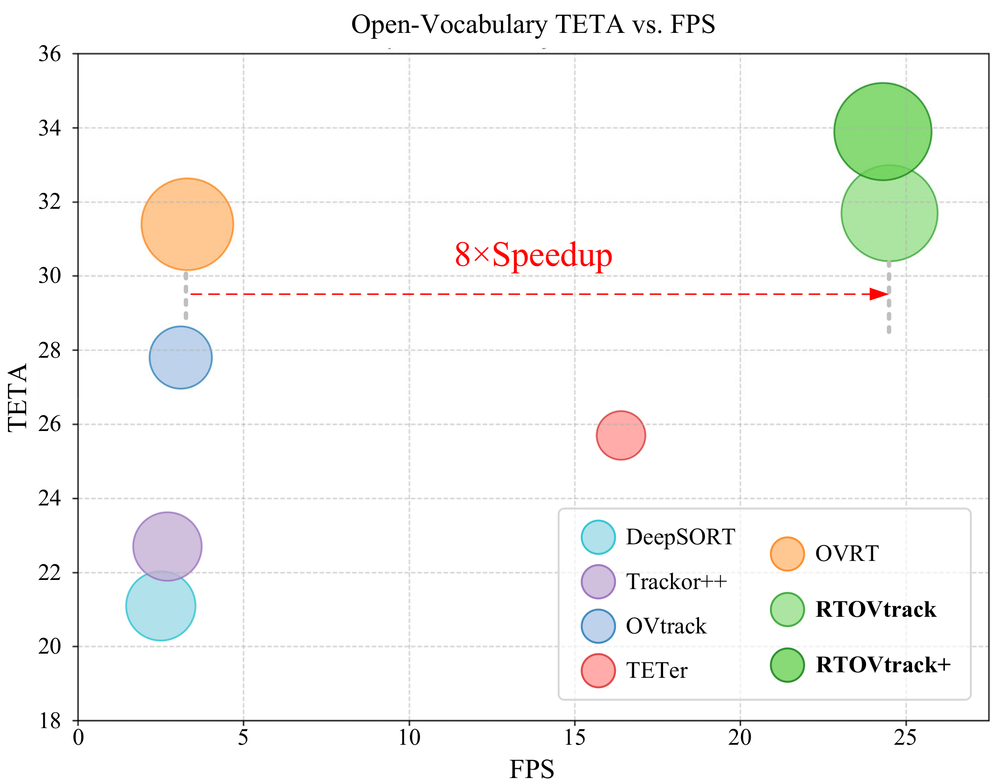
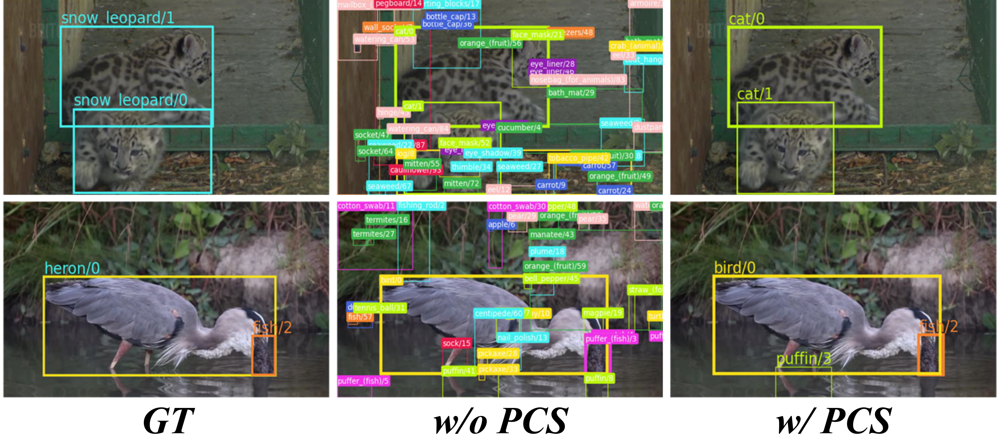

# RTOVTrack

**Towards Real-Time Open-Vocabulary Multi-Object Tracking with Prompt-Conditioned Suppression**

RTOVTrack is a real-time open-vocabulary multi-object tracking framework. It extends a one-stage open-vocabulary detector with a lightweight tracking head, Prompt-Conditioned Suppression (PCS), and a Dynamic Memory-aware Prompt Module (DMPM) to jointly handle localization, category prediction, and identity association.


<p align="center">
  
</p>

## Highlights

- **One-stage OV-MOT pipeline.** RTOVTrack performs detection, open-vocabulary classification, and tracking embedding extraction in a unified network.
- **Prompt-Conditioned Suppression.** PCS filters semantically unrelated detections before association using active class evidence and class-frequency priors.
- **Dynamic prompt memory.** DMPM keeps temporally active category prompts to reduce prompt drift during occlusion or re-appearance.
- **Real-time tracking.** The paper reports 24.5 FPS under the adopted TAO validation protocol, with up to 8x speedup over OVTR while retaining strong novel-category TETA.

<p align="center">
  
</p>

## Method Overview

RTOVTrack is built on the YOLO-World/MMYOLO stack. The detector produces bounding boxes, class embeddings, classification scores, and tracking embeddings in one forward pass. Before association, PCS estimates active classes and suppresses detections whose categories are unlikely to be relevant to the current video. DMPM then maintains a memory of active class IDs across frames, improving semantic continuity for long-tailed or temporarily occluded objects.


The tracking head is trained from key-reference image pairs generated from still-image annotations using strong sequence-style augmentation. This allows the model to learn identity-discriminative embeddings without requiring dense video annotations for every training sample.


## Qualitative Results

PCS reduces semantically irrelevant predictions and produces cleaner tracklets in open-vocabulary scenes.

<p align="center">
  
</p>


## Repository Layout

```text
RTOVTrack/
  assets/                 Paper draft and README figures
  configs/
    pretrain/             YOLO-World pretraining configs
    train_lvis/           RTOVTrack LVIS training config
  demo/
    mot_demo.py           Local video/image tracking demo
  requirements/           Python dependency lists
  yolo_world/
    datasets/             LVIS/TAO/video dataset adapters and transforms
    models/
      PCS/                Prompt-Conditioned Suppression
      dense_heads/        YOLO-World head with tracking outputs
      mot/                YOLOWorldSort MOT wrapper with DMPM
      tracker/            OV/SORT-style association modules
    engine/               Optimizer constructor
    hooks/                Training/logging hooks
```

Large local assets such as datasets, pretrained models, work directories, evaluation outputs, and `third_party/` are intentionally ignored by Git.

## Installation

This code is developed around OpenMMLab and YOLO-World/MMYOLO components. A typical setup is:

```bash
conda create -n rtovtrack python=3.8 -y
conda activate rtovtrack

pip install torch torchvision --index-url https://download.pytorch.org/whl/cu118
pip install -r requirements/basic_requirements.txt
```

Prepare MMYOLO under `third_party/mmyolo`, because the configs inherit from MMYOLO config files:

```bash
mkdir -p third_party
git clone https://github.com/open-mmlab/mmyolo.git third_party/mmyolo
cd third_party/mmyolo
git checkout v0.6.0
pip install -e .
cd ../..
```

Expose this repository and the local MMYOLO checkout to Python:

```bash
export PYTHONPATH=$PWD:$PWD/third_party/mmyolo:$PYTHONPATH
```

The local demo script currently imports the upstream YOLO-World inference API through a hard-coded path in `demo/mot_demo.py`. Before running the demo, replace that path with your local YOLO-World checkout or refactor it to use your installed package path.

## Data Preparation

The configs expect data under `data/`. A typical layout is:

```text
data/
  coco/
    annotations/
    lvis/
  tao/
    annotations/
  texts/
    coco_class_texts.json
    lvis_v1_class_texts.json
    obj365v1_class_texts.json
```

For LVIS tracking-head training, `configs/train_lvis/yolo_world_v2_x_train.py` also references:

```text
data/lvis_classes_v1.txt
data/lvis_clear_75_60_part.json
data/lvis_filtered_train_images.h5
```

Model checkpoints and CLIP text models are expected under `pretrained_models/`, for example:

```text
pretrained_models/
  yolo_world_v2_x_obj365v1_goldg_cc3mlite_pretrain_1280ft-14996a36.pth
  clip-vit-base-patch32-projection/
```

## Training

The current LVIS tracking-head config is:

```bash
python third_party/mmyolo/tools/train.py \
  configs/train_lvis/yolo_world_v2_x_train.py
```

The config freezes the CLIP text encoder, enables the tracking head, uses the custom `yolow_collate` function, and trains with sequence-style augmentation generated from LVIS images.

## Evaluation

For LVIS detection-style validation:

```bash
python third_party/mmyolo/tools/test.py \
  configs/train_lvis/yolo_world_v2_x_train.py \
  pretrained_models/your_rtovtrack_checkpoint.pth
```

TAO/OVT-B tracking evaluation uses the custom TAO/TETA dataset and metric code under `yolo_world/datasets/`. Keep the annotation paths in the config aligned with your local dataset layout.

## Demo

After preparing a checkpoint and fixing the local YOLO-World API path in `demo/mot_demo.py`, run:

```bash
python demo/mot_demo.py \
  demo/sample_images/track_demo.mp4 \
  configs/train_lvis/yolo_world_v2_x_train.py \
  --checkpoint pretrained_models/your_rtovtrack_checkpoint.pth \
  --text "person,car,dog" \
  --out outputs/track_demo.mp4 \
  --fps 30
```

`--text` accepts comma-separated prompts or a text file with one prompt per line.

## Results Reported in the Paper

The paper draft reports:

- TAO validation novel-category TETA: 31.7 for RTOVTrack and 33.9 for RTOVTrack+.
- TAO validation base-category TETA: 32.9 for RTOVTrack and 36.0 for RTOVTrack+.
- TAO test novel-category TETA: 29.1 for RTOVTrack+.
- Runtime: 24.5 FPS under the adopted GPU inference protocol.

Please refer to the paper draft for complete tables, benchmark settings, and ablations.


## Acknowledgement

This project builds on the OpenMMLab ecosystem and YOLO-World/MMYOLO codebase. Parts of the dataset and tracking utilities are adapted from open-vocabulary and OpenMMLab tracking projects.
